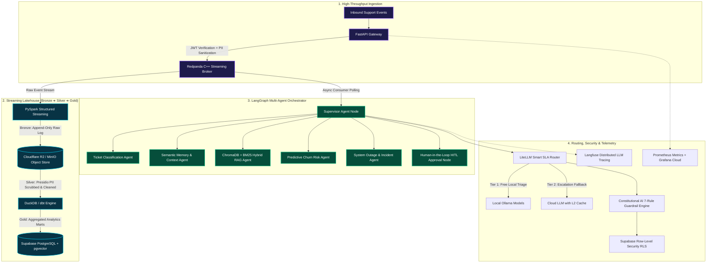

<div align="center">

<!-- ==================== HERO CAPSULE BANNER ==================== -->


<!-- ==================== CYBER MONOSPACE TYPING SVG ==================== -->
<a href="https://git.io/typing-svg">
  
</a>

<br/><br/>

<!-- ==================== QUICK ACTION PILLS ==================== -->
[](mailto:saibalajinamburi@gmail.com)
&nbsp;
[](https://maps.google.com/?q=Hildesheim,Germany)
&nbsp;
[](https://www.uni-hildesheim.de)

<br/>

[](https://linkedin.com/in/saibalajinamburi)
&nbsp;
[](https://saibalaji-portfolio.vercel.app)
&nbsp;
[](https://huggingface.co/spaces/saibalajiomg)
&nbsp;
[](https://dagshub.com/saibalajinamburi)
&nbsp;
[](mailto:saibalajinamburi@gmail.com)

</div>

<br/>

---

<!-- ==================== CYBER TERMINAL MOCKUP ==================== -->
<div align="center">

```bash
╭─ saibalaji@systems-core ~ 
╰─$ neofetch --profile-overview
```

</div>

<table>
<tr>
<td width="50%" valign="top">

```yaml
identity:
  developer: "Saibalaji Namburi"
  title: "AI Systems Engineer | MLOps Specialist"
  location: "Hildesheim, Lower Saxony, Germany 🇩🇪"
  availability: "Werkstudent (20h/wk) | Full-time Internship"
  mobility: "Hannover • Braunschweig • Wolfsburg • Göttingen • Remote"

education:
  msc: "M.Sc. International Data Analytics"
  institution: "University of Hildesheim, Germany (2026)"
  btech: "B.Tech AI & Data Science / ML (Saveetha, India)"
  gpa: "8.756 / 10 (First Class with Distinction)"

languages:
  english: "Fluent (IELTS 7.0)"
  german: "A1 (Active daily immersion & expansion)"
  telugu: "Native"
```

</td>
<td width="50%" valign="top">

```yaml
engineering_doctrine:
  philosophy: "Production software over notebook scripts"
  reliability: "300+ pytest test suites • CI/CD automation"
  safety_first: "EU AI Act compliance • Constitutional AI"
  data_privacy: "Presidio PII masking • AES-256 encrypted vaults"
  cost_efficiency: "Smart SLA routing (saving >50% inference costs)"
  
active_flagship:
  project: "CustomerCore"
  architecture: "Streaming Lakehouse + Multi-Agent Graph"
  status: "19 / 19 Phases Completed (Shipped)"
  verification: "307 passing automated test suites"
  live_deployment: "Hugging Face Spaces (Dockerized)"
```

</td>
</tr>
</table>

---

<!-- ==================== ANIMATED CONTRIBUTION SNAKE ==================== -->
<div align="center">

### 🐍 Real-Time Contribution Flow

<picture>
  <source media="(prefers-color-scheme: dark)" srcset="https://raw.githubusercontent.com/saibalajinamburi/saibalajinamburi/output/github-contribution-grid-snake-dark.svg">
  <source media="(prefers-color-scheme: light)" srcset="https://raw.githubusercontent.com/saibalajinamburi/saibalajinamburi/output/github-contribution-grid-snake.svg">
  
</picture>

</div>

---

<!-- ==================== THREE CORE ENGINEERING PILLARS ==================== -->
## ⚡ System Capabilities & Production Standards

<table>
<tr>
<td width="33%" valign="top">

<div align="center">
  <br/><br/>
  <b>🔬 Beyond Jupyter Notebooks</b>
</div>

* **Quantized Inference:** Slashing latency to **<10ms** and memory footprints by **80%** using **ONNX INT8** quantization with 100% label parity.
* **Feature & Model Stores:** Automated data validation with **Great Expectations**, feature serving with **Feast**, and model lineage via **MLflow & DVC**.
* **Leakage-Free Validation:** Eliminating synthetic data delusion using strict stateful **TimeSeriesSplit** walk-forward validations.

</td>
<td width="33%" valign="top">

<div align="center">
  <br/><br/>
  <b>🧠 Autonomous Multi-Agent Networks</b>
</div>

* **LangGraph Orchestration:** Stateful supervisor graphs coordinating specialized agents (Triage, Memory, RAG, Churn, Incident).
* **Sub-10ms Hybrid Retrieval:** Dense embeddings (**ChromaDB / pgvector**) fused with **BM25** keyword retrieval via Reciprocal Rank Fusion.
* **Deterministic Guardrails:** **Human-in-the-Loop (HITL)** approval workflows combined with **Constitutional AI policy checks**.

</td>
<td width="33%" valign="top">

<div align="center">
  <br/><br/>
  <b>🏗️ Streaming Lakehouse & Cloud</b>
</div>

* **Event-Driven Streaming:** High-throughput **Redpanda (C++ Kafka)** broker feeding asynchronous consumer pipelines.
* **Lakehouse Pipelines:** **PySpark** structured streaming (Bronze &rarr; Silver PII scrubbing &rarr; **dbt** Gold analytics marts).
* **Enterprise Security:** **Presidio PII** anonymization, **AES-256** field vaults, **Supabase Row-Level Security (RLS)**, and **Docker/K8s** packaging.

</td>
</tr>
</table>

---

<!-- ==================== FLAGSHIP SYSTEM SHOWCASE ==================== -->
## 🏆 Flagship Platform: CustomerCore

### 🔥 [CustomerCore — Real-Time B2B Autonomous Customer Intelligence](https://github.com/saibalajinamburi/CustomerCore)
> **Multi-Tenant Streaming Lakehouse & Autonomous Multi-Agent Support Triage Platform**  
> *Engineered to the production benchmarks of enterprise systems like Sierra AI and Decagon AI.*

<div align="center">

[](https://github.com/saibalajinamburi/CustomerCore)
&nbsp;
[](https://github.com/saibalajinamburi/CustomerCore)
&nbsp;
[](https://github.com/saibalajinamburi/CustomerCore)
&nbsp;
[](https://github.com/saibalajinamburi/CustomerCore)

</div>

<br/>

### 🛰️ Live System Topology & Multi-Agent Flowchart



<br/>

#### 💎 Engineering Highlights:
* **Production Multi-Tenancy:** Strict cryptographic isolation ensuring tenant records are bounded by Supabase Row-Level Security (RLS) and signed JWT payloads.
* **Dual-Tier SLA Cost Router:** Employs intelligent algorithmic routing dispatching 54% of incoming triage tasks to zero-cost local Ollama models with automatic cloud fallback.
* **GDPR & EU AI Act Ready:** Automated Presidio PII redaction pipeline with AES-256 field vaults and an 8-rule Constitutional AI policy barrier.
* **Full-Stack Observability:** End-to-end tracing with Langfuse Cloud, real-time latency & queue telemetry with Prometheus, and live Grafana monitoring.

<div align="center">

[](https://github.com/saibalajinamburi/CustomerCore)
&nbsp;
[](https://huggingface.co/spaces/saibalajiomg/customercore)
&nbsp;
[](https://dagshub.com/saibalajinamburi/CustomerCore)

</div>

---

<!-- ==================== PRODUCTION PROJECTS ==================== -->
## 🚀 Production & Open-Source Portfolio

<table>
<tr>
<td width="50%" valign="top">

### ⚡ [SupportPulse — AI Support Triage Platform](https://github.com/saibalajinamburi/SupportPulse)
`MLOps Pipeline` &bull; `LLM Cascade` &bull; `Feast Feature Store`

- **Two-Tier Cascade:** Gemma2:2b local classifier with automatic Gemma4:e4b fallback for sub-cent privacy triage.
- **Enterprise MLOps:** Feature store integration using **Feast**, contract validation via **Great Expectations**, and CI/CD pushing to GHCR.
- **Performance:** **95% classification accuracy** and **2ms** ChromaDB retrieval across 38 passing unit tests.

<br/>

[](https://github.com/saibalajinamburi/SupportPulse)
[](https://huggingface.co/spaces/saibalajiomg/SupportPulse)

</td>
<td width="50%" valign="top">

### 📄 [ResearchIQ — Automated Scientific Insight Engine](https://github.com/saibalajinamburi/researchiq)
`NLP` &bull; `ONNX INT8 Quantization` &bull; `DVC & MLflow`

- **Domain Scale:** Categorization and insight synthesis across 42k+ arXiv abstracts in 15 scientific disciplines.
- **Edge Optimization:** Applied **ONNX INT8 quantization**, cutting memory consumption by **80%** with **<10ms** latency and **100% label parity**.
- **Lineage:** DVC version-controlled datasets and DagsHub MLflow experiment registers.

<br/>

[](https://github.com/saibalajinamburi/researchiq)
[](https://huggingface.co/spaces/saibalajiomg/researchiq)

</td>
</tr>
<tr>
<td width="50%" valign="top">

### 📈 [Real-time Market Intelligence Engine](https://github.com/saibalajinamburi/Real-time-market-intelligence-engine)
`Financial ML` &bull; `TimeSeriesSplit` &bull; `Sentiment Streaming`

- **Bias Elimination:** Solved look-ahead bias and synthetic data delusions with stateful ingestion and walk-forward validation.
- **Signal Extraction:** Streaming news sentiment pipeline combined with backtesting against historical Max Drawdown.
- **Validation:** **55% realistic win-rate** on unseen walk-forward test sets.

<br/>

[](https://github.com/saibalajinamburi/Real-time-market-intelligence-engine)

</td>
<td width="50%" valign="top">

### ⚡ [Automated Research Paper Classifier](https://github.com/saibalajinamburi/Automated-Research-Paper-Classifier)
`CUDA Docker` &bull; `LightGBM` &bull; `HuggingFace Embeddings`

- **GPU Acceleration:** Packaged NVIDIA PyTorch CUDA Docker containers for high-speed embeddings computation.
- **CI/CD:** Automated GitHub Actions workflows orchestrating builds, unit tests, and container registry publishing.
- **Accuracy:** **75.2% accuracy** on multi-label scientific domain categorization.

<br/>

[](https://github.com/saibalajinamburi/Automated-Research-Paper-Classifier)

</td>
</tr>
<tr>
<td colspan="2" valign="top">

### 🦷 [DentalSolutions — AI Clinical Healthcare Platform (Google Play Live)](https://github.com/SaiBalaji-N/DentalSolutions_APP)
`Full-Stack Healthcare Mobile App` &bull; `FastAPI` &bull; `TensorFlow CNN` &bull; [Play Store Link](https://play.google.com/store/apps/details?id=com.simats.dentalsolutions)

- Delivered an end-to-end clinical healthcare management application connecting doctors with patients.
- Integrated automated appointment booking, WhatsApp notifications, and a **TensorFlow/Keras CNN** for instant dental X-ray diagnostics.
- Engineered backend REST APIs in FastAPI, optimizing complex query execution by **over 35%**.

</td>
</tr>
</table>

---

<!-- ==================== SKILLS & ARSENAL ==================== -->
## 🛠️ Technical Arsenal

<div align="center">

<!-- Modern Interactive Developer Icon Ribbon -->
<a href="https://skillicons.dev">
  
</a>

</div>

<br/>

<table>
<tr>
<th width="25%">Discipline</th>
<th>Technologies, Frameworks & Infrastructure</th>
</tr>
<tr>
<td><b>🧠 Agentic AI & RAG</b></td>
<td>
<code>LangChain</code> &bull; <code>LangGraph</code> &bull; <code>LlamaIndex</code> &bull; <code>LiteLLM</code> &bull; <code>ChromaDB</code> &bull; <code>FAISS</code> &bull; <code>Ollama</code> &bull; <code>Mem0</code> &bull; <code>Langfuse Tracing</code> &bull; <code>Constitutional AI</code>
</td>
</tr>
<tr>
<td><b>🤖 Machine Learning & Deep Learning</b></td>
<td>
<code>Python</code> &bull; <code>PyTorch</code> &bull; <code>scikit-learn</code> &bull; <code>Hugging Face Transformers</code> &bull; <code>LightGBM</code> &bull; <code>XGBoost</code> &bull; <code>ONNX Runtime</code> &bull; <code>Pandas</code> &bull; <code>NumPy</code> &bull; <code>spaCy</code> &bull; <code>Presidio</code>
</td>
</tr>
<tr>
<td><b>⚙️ MLOps & Containerization</b></td>
<td>
<code>Docker</code> &bull; <code>Kubernetes (Kind)</code> &bull; <code>MLflow</code> &bull; <code>DagsHub</code> &bull; <code>Feast Feature Store</code> &bull; <code>Great Expectations</code> &bull; <code>DVC</code> &bull; <code>GitHub Actions CI/CD</code>
</td>
</tr>
<tr>
<td><b>🌊 Streaming & Data Lakehouses</b></td>
<td>
<code>Redpanda (C++ Kafka Broker)</code> &bull; <code>Apache PySpark (Structured Streaming)</code> &bull; <code>dbt</code> &bull; <code>DuckDB</code> &bull; <code>Supabase (PostgreSQL + pgvector)</code> &bull; <code>MinIO S3</code> &bull; <code>MySQL</code>
</td>
</tr>
<tr>
<td><b>🔭 Telemetry, APIs & Protocols</b></td>
<td>
<code>FastAPI</code> &bull; <code>Prometheus Metrics</code> &bull; <code>Grafana Dashboards</code> &bull; <code>OpenTelemetry</code> &bull; <code>Streamlit</code> &bull; <code>REST APIs</code> &bull; <code>Server-Sent Events (SSE)</code>
</td>
</tr>
<tr>
<td><b>💻 Core Engineering & Tooling</b></td>
<td>
<code>Linux / Bash</code> &bull; <code>Git / GitHub</code> &bull; <code>Pytest (300+ suites)</code> &bull; <code>Pre-commit Hooks</code> &bull; <code>Ruff Linter</code> &bull; <code>VS Code</code>
</td>
</tr>
</table>

---

<!-- ==================== EDUCATION & BACKGROUND ==================== -->
## 🎓 Academic & Practical Experience

<table>
<tr>
<td width="50%" valign="top">

### 🎓 Academic Trajectory
* **M.Sc. International Data Analytics**  
  *University of Hildesheim, Germany* 🇩🇪 &bull; `2026`  
  *Core:* Advanced ML Systems, Distributed Computing, MLOps Architecture.
  
* **B.Tech Artificial Intelligence & Machine Learning**  
  *Saveetha School of Engineering, Chennai, India* 🇮🇳 &bull; `2021 – 2025`  
  *GPA:* **8.756 / 10** &bull; First Class with Distinction  
  *Core:* Deep Learning, Natural Language Processing, Statistical Analysis.

</td>
<td width="50%" valign="top">

### 💼 Engineering Experience
* **AI Application Developer (Internship)**  
  *Saveetha School of Engineering* &bull; `Apr 2024 – Mar 2025`  
  * Shipped **DentalSolutions** on Google Play Store for clinical dental management.
  * Designed modular FastAPI endpoints, achieving a **35% reduction in query latency**.
  * Deployed computer vision models for automated diagnostic triage.

</td>
</tr>
</table>

---

<!-- ==================== CURRENT HORIZONS ==================== -->
## 🔭 Current Engineering Roadmap

```
CustomerCore v1.0 Shipped         [████████████████████████████████] 100% (Completed & Verified)
LangGraph Multi-Agent Systems     [██████████████████████████████░░]  95% (Production Mastery)
Kubernetes & Cloud Deployments    [██████████████████████░░░░░░░░░░]  75% (Kind ➔ Helm ➔ Cloud)
EU AI Act Auditing & Governance   [████████████████████████░░░░░░░░]  80% (Risk Tiering & Rules)
German Language Fluency           [████████████░░░░░░░░░░░░░░░░░░░░]  40% (A1 ➔ B1 Daily Immersion)
```

---

<!-- ==================== CALL TO ACTION & CONTACT ==================== -->
<div align="center">

### 📍 Hildesheim, Germany &nbsp;|&nbsp; 📡 Open to Remote Opportunities (Germany / EU)

Available for **Werkstudent (Working Student)** or **Internship** roles:

`ML Engineering` &bull; `MLOps / LLMOps` &bull; `AI Systems Architecture` &bull; `Data Engineering`

<br/>

**Commutable to:** `Hannover` &bull; `Braunschweig` &bull; `Wolfsburg` &bull; `Göttingen` &bull; `Hildesheim` &bull; `Remote`

<br/>

[](https://linkedin.com/in/saibalajinamburi)
&nbsp;&nbsp;
[](mailto:saibalajinamburi@gmail.com)
&nbsp;&nbsp;
[](https://saibalaji-portfolio.vercel.app)
&nbsp;&nbsp;
[](https://github.com/saibalajinamburi)

<br/><br/>

<sub>Engineered with precision &bull; Saibalaji Namburi &bull; © 2026</sub>

</div>

<!-- ==================== FOOTER WAVE ==================== -->
