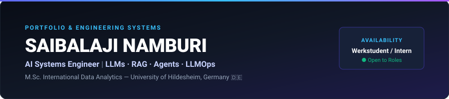
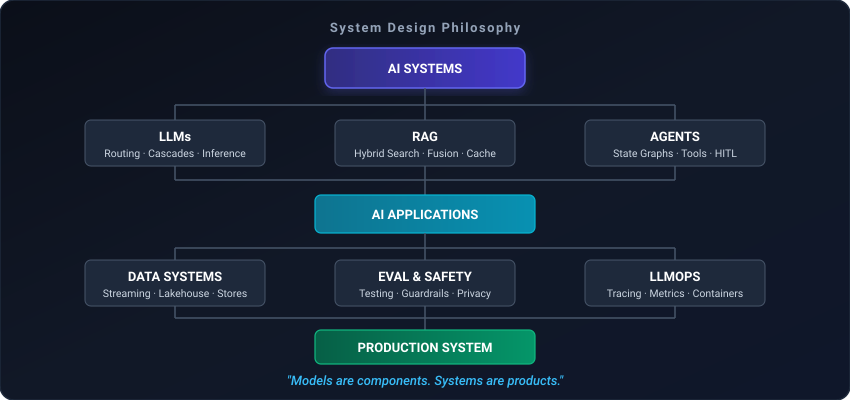
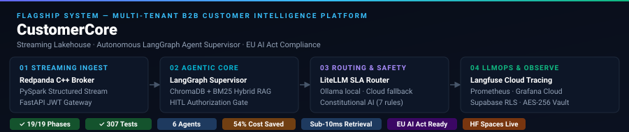

<div align="center">

<!-- HERO — dark/light responsive -->
<picture>
  <source media="(prefers-color-scheme: dark)"  srcset="assets/hero-dark.svg">
  <source media="(prefers-color-scheme: light)" srcset="assets/hero-light.svg">
  
</picture>

<br/>

<!-- Typing animation — identity, not a tech dump -->
[](https://git.io/typing-svg)

<br/>

[](https://linkedin.com/in/saibalajinamburi)
[](https://saibalaji-portfolio.vercel.app)
[](https://huggingface.co/spaces/saibalajiomg)
[](https://dagshub.com/saibalajinamburi)
[](mailto:saibalajinamburi@gmail.com)

<br/>

> I engineer production AI systems — multi-agent graphs, streaming lakehouses, hybrid RAG, and cost-aware inference pipelines that run in the real world.

</div>

<br/>

---

## What I Build

| | |
|:--|:--|
| **🧠 LLM Systems** | Production LLM apps, semantic SLA routing gateways, cost-aware local/cloud inference |
| **🔎 RAG Systems** | Hybrid dense+sparse retrieval, Reciprocal Rank Fusion, sub-10ms vector search |
| **🤖 Agentic AI** | Stateful LangGraph supervisor graphs, HITL authorization, deterministic tool-use |
| **⚙️ LLMOps** | Distributed tracing, evaluation frameworks, guardrails, containerized rollouts |
| **🌊 Data Systems** | Streaming event pipelines, medallion lakehouses, real-time feature stores |

---

## System Philosophy

<div align="center">

</div>

<br/>

```
  Evaluation before optimization  ·  Observability from day one  ·  Tests before production
  Security & privacy by design    ·  Cost-aware inference        ·  Reproducible deployments
```

---

## 🏆 Featured: CustomerCore

<div align="center">

</div>

<br/>

**[CustomerCore](https://github.com/saibalajinamburi/CustomerCore)** — Real-time B2B customer intelligence platform. Autonomous ticket triage, churn prediction, and incident detection at enterprise scale.

`LangGraph` · `Redpanda` · `PySpark` · `ChromaDB` · `LiteLLM` · `FastAPI` · `Supabase`

- **19 production phases** — shipped end-to-end, modular, containerized
- **307 automated test suites** — unit, integration, security, regression
- **Sub-10ms hybrid retrieval** — ChromaDB dense + BM25 keyword, Reciprocal Rank Fusion
- **6-agent supervisor graph** — Classify · Memory · RAG · Churn · Incident · HITL
- **54% LLM cost reduction** — intelligent SLA-aware local/cloud dual-tier routing

<div align="center">

[](https://github.com/saibalajinamburi/CustomerCore)
[](https://huggingface.co/spaces/saibalajiomg/customercore)
[](https://dagshub.com/saibalajinamburi/CustomerCore)

</div>

---

## Proof, Not Claims

| Shipped | Metric |
|:--|:--|
| CustomerCore — 307 pytest suites | 100% passing across unit · integration · security layers |
| ResearchIQ — ONNX INT8 quantization | 80% memory reduction · <10ms latency · 100% label parity |
| Market Intelligence Engine | Walk-forward TimeSeriesSplit · zero look-ahead bias · 55% OOS win-rate |
| DentalSolutions — Google Play | FastAPI microservices · CNN diagnostics · 35% DB query speedup |

---

## Selected Work

**[SupportPulse](https://github.com/saibalajinamburi/SupportPulse)** — Enterprise AI support triage  
Two-tier LLM cascade (Gemma2:2b → Gemma4:e4b), Feast feature store, Great Expectations, Docker GHCR CI/CD · **95% accuracy · 2ms retrieval**

**[ResearchIQ](https://github.com/saibalajinamburi/researchiq)** — Scientific insight engine  
BERT/RoBERTa over 42k+ arXiv abstracts · ONNX INT8 quantization · DVC + MLflow lineage · **80% memory cut · <10ms inference**

**[Real-time Market Intelligence](https://github.com/saibalajinamburi/Real-time-market-intelligence-engine)** — Financial AI pipeline  
Streaming news sentiment · walk-forward validation · backtesting with Max Drawdown · **55% out-of-sample win-rate**

**[DentalSolutions](https://github.com/SaiBalaji-N/DentalSolutions_APP)** — AI healthcare app · [Google Play ↗](https://play.google.com/store/apps/details?id=com.simats.dentalsolutions)  
Full-stack Flutter + FastAPI + TensorFlow CNN · WhatsApp integration · **live on Play Store · 35% DB speedup**

---

## Stack

<div align="center">

<a href="https://skillicons.dev">
  
</a>

</div>

<br/>

| | |
|:--|:--|
| **AI** | Python · PyTorch · Transformers · LangGraph · LangChain · LiteLLM · Ollama · ChromaDB |
| **Data** | PySpark · Redpanda · PostgreSQL · pgvector · DuckDB · dbt · Supabase |
| **MLOps** | MLflow · DVC · Feast · Great Expectations · Docker · Kubernetes · GitHub Actions |
| **Observability** | Langfuse · Prometheus · Grafana · OpenTelemetry · Presidio · Ruff · Pytest |

---

## Background

**M.Sc. International Data Analytics** — University of Hildesheim, Germany 🇩🇪 · `2026`  
**B.Tech AI & Machine Learning** — Saveetha School of Engineering, India 🇮🇳 · `2021–2025` · GPA **8.756 / 10**  
**AI Application Developer (Internship)** — Saveetha · `Apr 2024 – Mar 2025` · Shipped DentalSolutions to Google Play

---

## Now

🎓 &nbsp;M.Sc. Data Analytics — Hildesheim &nbsp;&nbsp;|&nbsp;&nbsp; 🔨 &nbsp;Building multi-agent systems & streaming lakehouses  
⚙️ &nbsp;Deepening: Kubernetes · LLM evaluation · distributed systems  
🎯 &nbsp;**Seeking:** Werkstudent (20h/wk) or Internship · AI Systems / MLOps / LLMOps  
📍 &nbsp;Hannover · Braunschweig · Wolfsburg · Göttingen · Hildesheim · Remote

---

<div align="center">

[](https://linkedin.com/in/saibalajinamburi)
&nbsp;
[](mailto:saibalajinamburi@gmail.com)
&nbsp;
[](https://saibalaji-portfolio.vercel.app)

<br/>

<sub>Saibalaji Namburi · 2026</sub>

</div>
